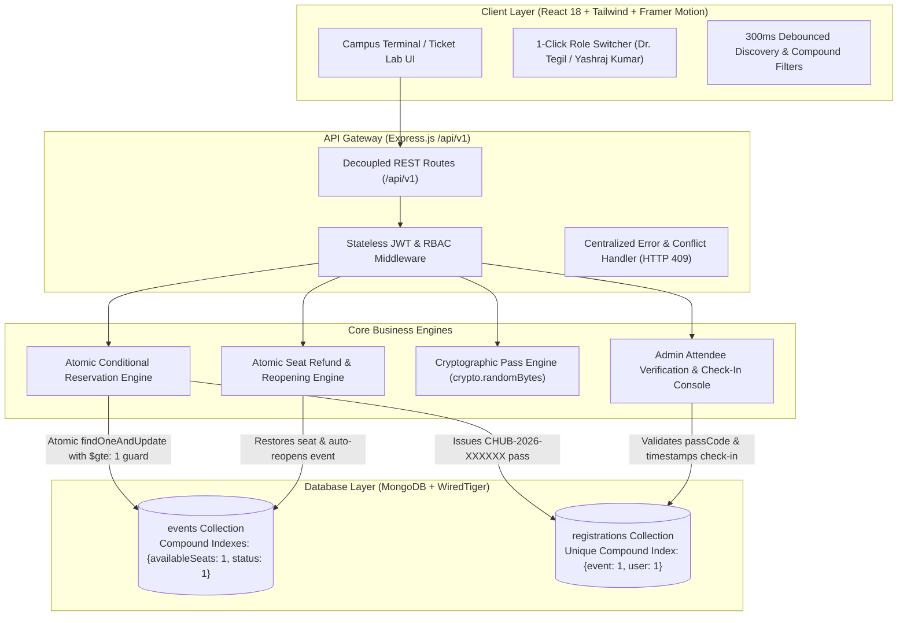

# ⚡ CampusHub — High-Concurrency Event Reservation Platform

[-10B981?style=for-the-badge&logo=render&logoColor=white)](https://campus-event-management-system-hedl.onrender.com/)

[](https://nodejs.org)
[](https://expressjs.com)
[](https://mongodb.com)
[](https://react.dev)
[](https://tailwindcss.com)

> 🌐 **Live Production URL:** [https://campus-event-management-system-hedl.onrender.com/](https://campus-event-management-system-hedl.onrender.com/)  
> **Portfolio & Resume Project:** Prepared for **Adobe Technical Consultant (Domain 2: Backend & Software Engineering)**.  
> Demonstrates atomic concurrency control, race condition elimination under high traffic spikes, cryptographic pass generation, transactional seat rollback, and modern 2026 dark terminal aesthetics.

---

## 🏛️ System Architecture & Concurrency Model



---

## 🌟 Core Engineering Highlights

### 1. Atomic Concurrency Control (Zero Overbooking)
- University registrations routinely experience traffic surges where hundreds of students attempt to claim the last remaining seats simultaneously.
- **Naive Implementation (Anti-Pattern):** An application-layer read-then-write (`if (event.availableSeats > 0) { event.availableSeats--; await event.save(); }`) causes race conditions, leading to negative seat counts and severe overbooking.
- **CampusHub Solution:** Uses single-instruction atomic conditional operations via MongoDB's aggregation update pipeline inside `findOneAndUpdate`:
  ```javascript
  const updatedEvent = await Event.findOneAndUpdate(
    {
      _id: eventId,
      availableSeats: { $gte: 1 },
      status: { $in: ['Registration Open', 'Published'] },
    },
    [
      {
        $set: {
          availableSeats: { $subtract: ['$availableSeats', 1] },
          status: {
            $cond: {
              if: { $lte: [{ $subtract: ['$availableSeats', 1] }, 0] },
              then: 'Registration Closed',
              else: '$status',
            },
          },
        },
      },
    ],
    { new: true }
  );
  ```
- Guaranteed at the database storage engine layer (WiredTiger document-level locking) with zero application-level race windows. Returns `HTTP 409 Conflict: Event Capacity Reached` when capacity is exhausted.

### 2. Zero-Latency State Transition
- The exact millisecond `availableSeats` transitions from `1` to `0`, the status atomically flips from `Registration Open` to `Registration Closed` within the exact same database write operation.

### 3. Atomic Seat Rollback & Pass Invalidation
- When a student cancels their pass (`DELETE /api/v1/registrations/:id`), the ticket is immediately flagged as `CANCELLED`, recording `cancelledAt`.
- The seat counter is atomically incremented (`$add: 1`) capped strictly at `maxParticipants`.
- If the event was previously marked `Registration Closed` and the event date is still in the future, the status automatically reverts to `Registration Open`.

### 4. Cryptographic Digital Pass Engine
- Every confirmed registration generates a unique cryptographic pass code: `CHUB-2026-[HEX6]` (e.g., `CHUB-2026-X9A7K2`).
- Renders a live SVG QR code with boarding-pass perforation cut lines, punch hole notches, and visual status watermarks (`ACTIVE`, `CHECKED_IN`, `CANCELLED`).
- Faculty admins can scan or input pass codes to verify and check in attendees in real time.

### 5. Multi-Parameter Compound Discovery
- 300ms debounced text search indexing titles, descriptions, speakers, and venues.
- Compound filtering across Category (`Workshop`, `Hackathon`, `Seminar`, `Cultural`), Venue (`CS Lab`, `Auditorium`, `Seminar Hall`), Date ranges (`Today`, `Upcoming`, `This Week`), and a live "Available Seats Only" toggle.

---

## 🎨 2026 "Campus Terminal / Minimal Ticket Lab" UI

Designed to meet modern developer tool standards:
- **Canvas:** Ultra-deep dark canvas (`#0A0C10`), structural cards (`#161B22`), and crisp borders (`#30363D`).
- **Accents:** Electric Indigo (`#6366F1`) primary CTA, Neon Mint (`#10B981`) for confirmed seats, Coral Red (`#F43F5E`) for capacity-closed events, and Amber (`#F59E0B`) for critical capacity (<5 seats).
- **Physical Ticket Details:** Dashed perforation lines, circular punch notches, dynamic barcode lines, and mock QR visualizers.
- **1-Click Role Switcher:** Instant top navbar toggle between **Student: Yashraj Kumar** and **Faculty Admin: Dr. Tegil**.

---

## 👥 Demo Test Accounts

| Role | Name | Email | Password | Key Capabilities |
| :--- | :--- | :--- | :--- | :--- |
| **Faculty Admin** | Dr. Tegil | `admin@campus.edu` | `Admin@123` | Create/edit events, view analytics KPIs, attendee roster, live pass check-in |
| **Student 1** | Yashraj Kumar | `student1@campus.edu` | `Student@123` | Discover events, reserve passes, cancel reservations, QR ticket wallet |
| **Student 2** | Aarav Sharma | `student2@campus.edu` | `Student@123` | Multi-user booking tests & capacity exhaustion simulations |

*(Use the top navbar **Role Switcher** to switch profiles instantly with one click)*

---

## 🚀 Quick Start & Installation

### 1. Prerequisites
- **Node.js:** v18.0.0 or higher
- **MongoDB:** Local instance running on port 27017 (`mongodb://127.0.0.1:27017/campus_events`) or MongoDB Atlas URI.

### 2. Install All Dependencies
```bash
npm run install:all
```

### 3. Seed Database
Seeds pristine accounts, realistic university events, and active digital passes:
```bash
npm run seed
```

### 4. Start Development Servers
Runs both the Express backend (`http://localhost:5000`) and the Vite client (`http://localhost:5173`) concurrently:
```bash
npm run dev
```

### 5. Run Concurrency & System Stress Test
Executes the automated 7-stage validation suite, firing parallel asynchronous bookings against 2 available seats to prove zero overbooking:
```bash
npm run test:concurrency
```

---

## 📡 REST API Reference (`/api/v1`)

### Authentication (`/api/v1/auth`)
| Method | Endpoint | Access | Description |
| :--- | :--- | :--- | :--- |
| `POST` | `/api/v1/auth/register` | Public | Register new student account |
| `POST` | `/api/v1/auth/login` | Public | Authenticate user & return JWT token |
| `GET` | `/api/v1/auth/me` | Private | Retrieve authenticated profile |

### Events (`/api/v1/events`)
| Method | Endpoint | Access | Description |
| :--- | :--- | :--- | :--- |
| `GET` | `/api/v1/events` | Public | Debounced text search, category, venue, date, seat availability |
| `GET` | `/api/v1/events/stats` | Admin | Real-time analytics, sold out count, capacity utilization |
| `GET` | `/api/v1/events/:id` | Public | Retrieve single event detail with remaining capacity |
| `GET` | `/api/v1/events/:id/attendees` | Admin | Attendee roster for event with pass codes & check-in status |
| `POST` | `/api/v1/events` | Admin | Create event with initial capacity allocation |
| `PUT` | `/api/v1/events/:id` | Admin | Update event details or lifecycle status |
| `DELETE` | `/api/v1/events/:id` | Admin | Delete event and cascade invalidate reservations |

### Reservations (`/api/v1/registrations`)
| Method | Endpoint | Access | Description |
| :--- | :--- | :--- | :--- |
| `POST` | `/api/v1/events/:id/book` | Student/Admin | **Atomic conditional reservation** with `$gte: 1` guard |
| `GET` | `/api/v1/registrations/my` | Private | Digital pass wallet for current user |
| `DELETE`| `/api/v1/registrations/:id` | Private | **Atomic seat rollback** & pass invalidation |
| `POST` | `/api/v1/registrations/verify-pass` | Admin | Real-time pass code verification and attendee check-in |
| `PATCH`| `/api/v1/registrations/:id/checkin` | Admin | Check-in toggle by registration ID |

---

## 🎓 Adobe Technical Consultant Interview Guide

For complete technical questions, architectural deep dives, WiredTiger concurrency analysis, and the live demo script, see:  
👉 **[INTERVIEW_PREP_GUIDE.md](file:///c:/Users/Yashwant%20Kumar/Desktop/Campus%20Event%20&%20Workshop%20Management/INTERVIEW_PREP_GUIDE.md)**

### Key Technical Talking Points:
1. **Concurrency vs Locking Overhead:** Why single-operation conditional aggregation updates in MongoDB avoid heavy distributed locks while guaranteeing linearizability.
2. **Idempotency & Double-Booking Guards:** Unique compound index `{ event: 1, user: 1 }` on the `registrations` collection prevents duplicate bookings even if a user double-clicks.
3. **Horizontal Scalability:** For 100,000+ simultaneous bookings, scale by placing Redis Lua scripts (`redis.eval(DECRBY)`) as an in-memory ticket lease layer backed by Kafka event queues and asynchronous worker writers.
